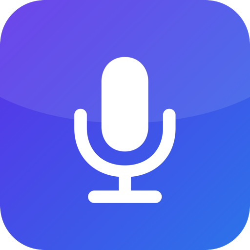

<div align="center">
  
  <h1>HandsFree</h1>
  <p><strong>Fast, private, open-source voice dictation for macOS.</strong></p>
  <p>
    Hold a hotkey, speak, release → cleaned text lands wherever your cursor is.
  </p>
</div>

<p align="center">
  <a href="https://github.com/Harikrishnareddyl/hands_free/releases"></a>
  <a href="LICENSE"></a>
  
</p>

---

Open-source alternative to [Wispr Flow](https://wisprflow.ai), [Superwhisper](https://superwhisper.com), and Monologue — built on [Groq](https://groq.com)'s Whisper API. Your audio streams only to Groq. No subscription, no telemetry, no servers of our own. ~**$0.04 per hour of audio**, pay-as-you-go.

## Features

- 🎙️ Push-to-talk via **Fn (🌐)** or **⌃⌥D**, works in any app
- 📋 Pastes into the focused text field — Gmail, Slack, Notion, VS Code, web forms — or falls back to the clipboard if nothing is focused
- 🗂️ Searchable local history in SQLite (`~/Library/Application Support/HandsFree/history.sqlite`)
- 🧠 Vocabulary hints bias Whisper toward names/acronyms you use often
- 🔴 Floating recording-pill overlay at the bottom of the screen
- 🎨 Menu-bar app — no Dock icon, no window, stays out of your way
- 🔐 API key lives in a user-only file (`mode 0600`) — no Keychain prompts
- 🚀 Launch at login
- 🌍 100+ languages (Whisper auto-detects)
- 🔄 Checks GitHub on launch for updates — one click reinstalls the latest release

## Install

### One-liner (recommended)

```bash
curl -fsSL https://raw.githubusercontent.com/Harikrishnareddyl/hands_free/main/install.sh | bash
```

Downloads the latest DMG, installs `HandsFree` into `/Applications`, launches the app. Takes ~10 seconds.

### Manual install

1. Download the latest **`HandsFree-X.Y.Z.dmg`** from the [Releases](https://github.com/Harikrishnareddyl/hands_free/releases) page.
2. Open the DMG and drag **HandsFree** into **Applications**.
3. Double-click **HandsFree** from Applications. Releases are **signed + notarized** by Apple — no Gatekeeper warning, no right-click-open, no quarantine workaround needed.
4. The microphone icon appears in your menu bar.

## First-run setup

On every launch, HandsFree checks whether it has the three **required** permissions — **Microphone**, **Accessibility**, and a **Groq API key**. If any of them is missing, a setup window appears that you can't continue past until they're granted (or you hit **Quit**). Once everything's green, click **Continue** and the app runs normally. You can reopen the window anytime from the menu bar → **Setup / Permissions…**.

### 1. Add your Groq API key

Get a free key at [**console.groq.com/keys**](https://console.groq.com/keys). Then from the menu-bar icon open **Settings…** → click **Set up key…** and follow the terminal commands shown, or run them directly:

```bash
mkdir -p ~/Library/Application\ Support/HandsFree
chmod 700 ~/Library/Application\ Support/HandsFree
printf '%s' 'gsk_YOUR_KEY_HERE' > ~/Library/Application\ Support/HandsFree/groq-key
chmod 600 ~/Library/Application\ Support/HandsFree/groq-key
```

Reopen Settings and the status should flip to **Configured ✓**.

### 2. Grant macOS permissions

HandsFree needs three permissions. It'll prompt you on first use:

| Permission | Why | Where |
|---|---|---|
| **Microphone** | Capture your voice | System Settings → Privacy & Security → Microphone |
| **Accessibility** | Paste into the focused field | System Settings → Privacy & Security → Accessibility |
| **Input Monitoring** | Detect the global `Fn` key | System Settings → Privacy & Security → Input Monitoring |

### 3. Free up the Fn / 🌐 key (optional)

By default, macOS hijacks **Fn** for dictation or the emoji picker. To let HandsFree own it: **System Settings → Keyboard → Press 🌐 key to →** `Do Nothing`.

If you'd rather not free it, just use **⌃⌥D** instead — both work.

## Use it

Position your cursor in any text field. **Hold Fn (or ⌃⌥D), speak, release.** Cleaned text appears at the cursor. That's the whole thing.

| What | How |
|---|---|
| Dictate | Hold `Fn` or `⌃⌥D` while speaking |
| Open Settings | Menu-bar icon → Settings… (`⌘,`) |
| Browse history | Menu-bar icon → History… (`⌘Y`) |
| Test without hotkey | Menu-bar icon → Debug → *Test: record 3s now* |
| Copy diagnostics | Menu-bar icon → Debug → *Copy Diagnostics* |
| Quit | Menu-bar icon → Quit HandsFree (`⌘Q`) |

### Status pill

A small rounded pill appears at the bottom-center of your screen while dictating:

- **Red dot + "Recording…"** — actively capturing audio
- **Spinner + "Transcribing…"** — uploading to Groq and waiting for the text
- Hidden when idle

### Sounds

Three options under **Settings → Sounds**:

- **Off** — silent
- **Start / end chimes only** — ascending tone on record, descending tone on delivery
- **Chimes + processing tick** — adds a subtle tick every 1.5s while Groq is thinking

## Updates

HandsFree hits the GitHub Releases API on launch to check whether a newer version is available. If one is, you'll see an alert with **Install update** / **Release notes** / **Later**. Clicking **Install update** runs the same `install.sh` flow in the background, quits the old app, and relaunches the new version. Your settings, history DB, and Groq API key all live outside the bundle so they survive upgrades untouched.

You can also trigger a check anytime: menu bar → **Check for Updates…**

## Cost

Groq's `whisper-large-v3-turbo` is **$0.04/hour of audio**. Typical usage:

| Usage | Audio/month | Cost |
|---|---|---|
| Light (20 dictations/day, 10s each) | ~1 hr | **$0.04** |
| Medium (100 dictations/day, 10s each) | ~5 hr | **$0.20** |
| Heavy (constant dictation) | ~20 hr | **$0.80** |

No subscription. No minimum. You only pay Groq for what you actually dictate.

## How it works

```
┌────────────────────────────────────────────────────────────┐
│  Menu-bar app (Swift 5.9, AppKit + SwiftUI)                │
│                                                             │
│  Hotkey (Fn or ⌃⌥D)                                        │
│        │                                                    │
│        ▼                                                    │
│  AudioRecorder ──► AVAudioConverter ──► 16 kHz mono WAV    │
│                                              │              │
│                                              ▼              │
│                                         GroqClient          │
│                                   (whisper-large-v3-turbo)  │
│                                              │              │
│                                              ▼              │
│                                          clean text         │
│                                              │              │
│               ┌──────────────────────────────┤              │
│               ▼                              ▼              │
│      TextInserter                      HistoryStore         │
│  (NSPasteboard + ⌘V)                  (SQLite / GRDB)       │
└────────────────────────────────────────────────────────────┘
```

1. Audio is captured at 48 kHz via `AVAudioEngine`, then **downsampled to 16 kHz mono int16** by `AVAudioConverter` — the exact format Whisper wants. A 5-second clip uploads as ~160 KB instead of ~1.9 MB.
2. The WAV is posted to Groq's `/v1/audio/transcriptions` endpoint with any vocabulary hints you've configured as the `prompt` parameter.
3. Whisper returns punctuated, capitalized text.
4. If a text field is focused (via `AXUIElementCopyAttributeValue(kAXFocusedUIElementAttribute)`), we put the text on the pasteboard and synthesize a `⌘V` via `CGEvent`. Otherwise it just sits on the clipboard.
5. Every dictation — raw transcript, timestamp, duration, and the bundle ID of the app that was focused — goes into a local SQLite history.

No LLM post-processing. No cleanup pass. The Whisper model already handles punctuation, and we pass it a conservative vocabulary hint to improve accuracy on names/acronyms. That's the whole pipeline.

## Build from source

```bash
git clone https://github.com/Harikrishnareddyl/hands_free.git
cd hands_free

# Install build tools
brew install xcodegen create-dmg

# One-time: create a stable self-signed code-signing cert so macOS TCC
# (Accessibility, Input Monitoring) grants survive rebuilds.
./scripts/setup-signing.sh

# Generate the Xcode project and build Debug
xcodegen generate
xcodebuild -scheme HandsFree -configuration Debug -derivedDataPath .build build

# Launch
open .build/Build/Products/Debug/HandsFree.app
```

To produce a shareable DMG:

```bash
./scripts/build-dmg.sh
```

Output: `HandsFree-0.1.0.dmg` in the repo root. See the script's header for notarization options (requires a paid Apple Developer account).

Releases are built automatically by `.github/workflows/release.yml` on every `v*` tag push. By default the workflow uses ad-hoc signing — for stable signatures that let user TCC permissions persist across releases, follow [docs/SIGNING.md](docs/SIGNING.md) to export your local cert and add it as GitHub secrets.

## Project layout

```
HandsFree/
├── HandsFreeApp.swift          # @main entry
├── AppDelegate.swift           # Menu bar + pipeline orchestration
├── Core/
│   ├── HotKeyManager.swift     # ⌃⌥D via KeyboardShortcuts lib
│   ├── FnHotKeyMonitor.swift   # Fn key via CGEventTap
│   ├── AudioRecorder.swift     # AVAudioEngine + AVAudioConverter
│   ├── WAVWriter.swift         # Streaming 16-bit PCM WAV
│   ├── GroqClient.swift        # Multipart upload to Groq
│   ├── TextInserter.swift      # Pasteboard + CGEvent ⌘V
│   ├── FocusInspector.swift    # Accessibility focused-field check
│   ├── HistoryStore.swift      # GRDB / SQLite, paginated
│   └── SoundEffects.swift      # Synthesized chimes + tick
├── UI/
│   ├── SettingsView.swift      # SwiftUI preferences
│   ├── HistoryView.swift       # SwiftUI searchable history
│   ├── RecordingPill.swift     # Floating NSPanel status pill
│   └── WindowCoordinator.swift # AppKit window lifecycle
├── Support/
│   ├── APIKeyStore.swift       # File-based key storage
│   ├── Secrets.swift           # Env var / file resolution + migration
│   ├── Preferences.swift       # UserDefaults wrapper
│   ├── LaunchAtLogin.swift     # SMAppService
│   ├── LaunchGuards.swift      # Single-instance + DMG detection
│   └── Log.swift               # NSLog wrapper
└── Resources/
    └── AppIcon.icns

scripts/
├── setup-signing.sh            # One-time: make a stable self-signed cert
├── build-dmg.sh                # Build + sign + DMG (+ optional notarize)
├── make-icon.swift             # Render 1024×1024 icon via CoreGraphics
└── make-icns.sh                # Build .icns + docs/logo.png
```

## FAQ

**Does it work offline?**
No. Whisper runs on Groq's servers. If you need offline dictation, [OpenWhispr](https://github.com/OpenWhispr/openwhispr) or [SuperWhisper](https://superwhisper.com) can run local models.

**Does Groq see my voice?**
Yes, during the transcription call. They don't retain it — see [Groq's data policy](https://groq.com/privacy-policy/). If that's not acceptable, run a local Whisper instead.

**How is this different from Wispr Flow?**
No monthly subscription (pay-as-you-go to Groq). Fully open source. No multi-device sync, no team snippets, no per-app style adaptation. For the core "hold, talk, paste" loop, they're functionally equivalent. For workflows beyond that, Wispr wins.

**Can I use a different transcription provider?**
Right now, no — `GroqClient` is hardcoded. PRs that add OpenAI / Deepgram / fal.ai support are welcome.

**Why does the app ask for Accessibility?**
To paste into fields owned by *other* applications, macOS requires either synthetic keyboard events (`CGEvent`) or AX APIs — both gated behind the Accessibility permission. Every tool in this category (Wispr Flow, Raycast, Alfred, Rectangle) needs the same grant.

**Why is there no Dock icon?**
Intentional. `LSUIElement: YES` in the Info.plist keeps HandsFree out of the Dock and ⌘-Tab list. It lives only in the menu bar, like 1Password mini or Alfred.

## Contributing

Issues and PRs welcome. Keep changes small and focused — this project stays deliberately lean.

Before opening a PR:

1. Build the Debug configuration (`xcodebuild -scheme HandsFree -configuration Debug build`) — no warnings.
2. Exercise the feature you changed end-to-end (audio/paste/DB/pill are easy to break separately).
3. If you're adding a setting, update `Preferences.swift` + `SettingsView.swift` + the README table.

## License

[MIT](LICENSE).

## Credits

- [Groq](https://groq.com) — blazing-fast Whisper inference.
- [sindresorhus/KeyboardShortcuts](https://github.com/sindresorhus/KeyboardShortcuts) — global shortcut management.
- [groue/GRDB.swift](https://github.com/groue/GRDB.swift) — SQLite + records.
- [create-dmg](https://github.com/create-dmg/create-dmg) — DMG layout.
- [Wispr Flow](https://wisprflow.ai), [Superwhisper](https://superwhisper.com), [Monologue](https://monologue.to) — for setting the UX bar.
